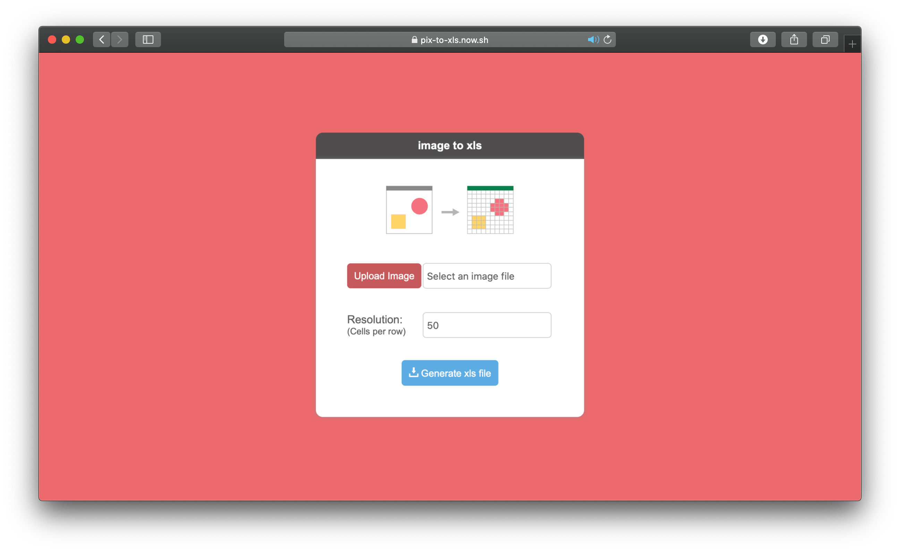
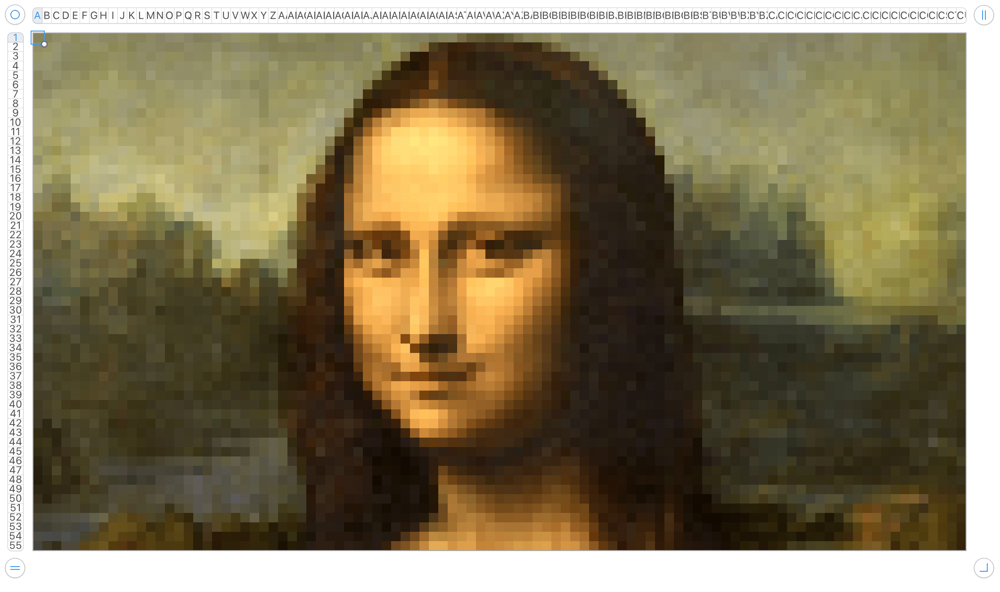

# pix-to-xls

A simple tool to convert an image to xls file using colored cells.


  
## How to use

### Online

https://www.image2xls.com/



### As python package

Install Python package:

```bash
pip3 install pix-to_xls
```

You can import this package too.

```python
from pix_to_xls import builder

builder.build("your_image.jpg", "your_output_file.xls", cols=50)
```

### CLI

We provide a CLI for an easiest way to use.

Install Python package:

```bash
pip3 install pix-to-xls
```

And just run the `pix-to-xls` command

```bash
pix-to-xls your_image.jpg your_output_file.xls
```

### Examples




 
